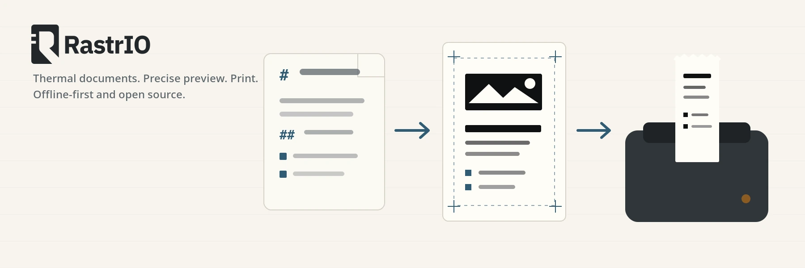
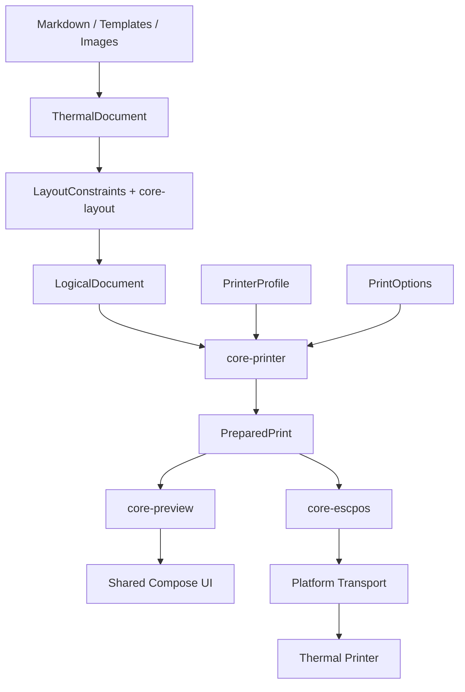

<div align="center">

<picture>
  <source media="(prefers-color-scheme: dark)" srcset="assets/brand/logo/rastrio-wordmark-horizontal-inverse.svg">
  <source media="(prefers-color-scheme: light)" srcset="assets/brand/logo/rastrio-wordmark-horizontal.svg">
  
</picture>

### Thermal documents. Precise preview. Print.

**Open-source, offline-first thermal document authoring, preview, and printing — built with Kotlin Multiplatform.**

[](LICENSE)


</div>

<picture>
  <source media="(prefers-color-scheme: dark)" srcset="assets/readme/hero-dark.webp">
  <source media="(prefers-color-scheme: light)" srcset="assets/readme/hero-light.webp">
  
</picture>

> [!IMPORTANT]
> **Rastrio is in active pre-alpha development.** This README describes the project architecture and intended stable behavior; not every capability listed below is implemented yet. Android is the first production target.

## What is Rastrio?

Rastrio is an Apache-2.0 Kotlin Multiplatform application and thermal-printing stack for turning ordinary content into reliable output on inexpensive ESC/POS-compatible thermal printers.

The goal is to make a thermal printer behave more like a useful general-purpose document printer. Users should be able to work with Markdown, notes, lists, QR payloads, and images without having to understand code pages, raster packing, printer widths in dots, ESC/POS command bytes, Bluetooth sockets, USB endpoints, or firmware quirks.

Rastrio is **not a POS application** and not a raw ESC/POS terminal. It is a document system with a printer-engineering layer underneath it.

## Why Rastrio?

| Principle | What it means |
| --- | --- |
| **Preview what will actually print** | Physical preview and ESC/POS encoding consume the same immutable `PreparedPrint`. There is no separate “preview layout” implementation. |
| **Portable documents** | `.td` stores semantic document content and limited layout intent — never Bluetooth identities, ESC/POS bytes, printer code pages, or transport configuration. |
| **Data-driven printers** | Printer capabilities and quirks live in validated `PrinterProfile` data rather than model-specific constants scattered through the codebase. |
| **Offline-first** | Authoring, conversion, preview, and printing are designed to work without an account or network connection. |
| **Shared where it matters** | Core logic and primary UI are shared with Kotlin Multiplatform and Compose Multiplatform; real OS/hardware integrations stay platform-specific. |
| **Deterministic by design** | Layout, rasterization, serialization, and protocol transformations are designed for exact automated and golden testing. |

## What Rastrio is designed to handle

### Documents and authoring

- GitHub Flavored Markdown
- Todo/checklist workflows
- Shopping lists
- Quick notes and memos
- QR messages
- Image printing
- Portable `.td` thermal documents

### Thermal output

- printer-specific physical preview
- native ESC/POS text where reliable
- raster fallback for unsupported text
- deterministic thermal image processing
- threshold, Bayer, Atkinson, and Floyd–Steinberg dithering
- native/raster QR strategy selection
- manual cut guides and cutter operations where supported
- printer profiles and per-printer configuration
- bounded-memory raster streaming for long output

### Platform direction

| Platform | Role |
| --- | --- |
| **Android** | Primary production and release target; Bluetooth Classic first, USB later |
| **Desktop/JVM** | First-class development target; Windows and Linux are the initial desktop product targets |
| **Web/Wasm** | Later product target; browser hardware support is capability-dependent |
| **macOS** | Possible later desktop packaging target |
| **iOS** | Explicitly out of scope |

## The core invariant

Rastrio separates **what a document means** from **how a particular printer will physically produce it**.



`ThermalDocument` is portable and printer-independent.

`PreparedPrint` is printer-specific, immutable, and authoritative. Once it exists, downstream code may serialize or display it — it may **not** independently re-wrap text, re-dither images, change code pages, choose another QR strategy, or otherwise reinterpret the physical print plan.

## Portable formats

### `.td` — thermal document

`.td` is Rastrio's portable semantic document format. Version 1 uses a ZIP-compatible container with UTF-8 JSON and embedded assets.

A `.td` file describes content such as paragraphs, headings, lists, tables, images, QR codes, formatting intent, and document layout intent. It does **not** contain printer commands or transport configuration.

See [`docs/TD_SPEC.md`](docs/TD_SPEC.md).

### `.tcfg` — printer profile

`.tcfg` describes a portable printer capability profile using UTF-8 JSON. Profiles can describe printable geometry, DPI, native fonts, code pages, raster strategies, QR/cutter support, protocol strategies, and validated quirks.

A profile describes a printer model/capability set. It is deliberately separate from a user's physical `PrinterInstance`, which may contain local Bluetooth or USB identity information.

See [`docs/TCFG_SPEC.md`](docs/TCFG_SPEC.md).

## Architecture

Rastrio keeps portable printer intelligence separate from application hosts and transports.

```text
rastrio/
├── androidApp/          Android host, Bluetooth, USB, Android services
├── desktopApp/          JVM host and later desktop integrations
├── webApp/              Wasm host and browser integrations
├── shared/              Shared presentation + Compose Multiplatform UI
│
├── core/
│   ├── document/        ThermalDocument and .td
│   ├── markdown/        GFM → ThermalDocument
│   ├── templates/       Structured workflows → ThermalDocument
│   ├── text/            Text metrics, shaping and raster-text contracts
│   ├── layout/          Logical geometry under LayoutConstraints
│   ├── raster/          Deterministic image/raster processing
│   ├── profile/         PrinterProfile and .tcfg
│   ├── printer/         Physical preparation → PreparedPrint
│   ├── preview/         Logical and physical preview models
│   └── escpos/          PreparedPrint → ESC/POS bytes
│
├── docs/                Architecture and normative specifications
├── test-fixtures/       Golden and regression fixtures
├── assets/              Production brand and repository artwork
├── AGENTS.md            Repository operating rules for coding agents
└── PRD.md               Authoritative product/engineering baseline
```

Core modules do not depend on Android or Compose. Platform applications own genuine operating-system concerns such as Bluetooth, USB, file pickers, permissions, clipboard access, lifecycle, and browser hardware APIs.

For the complete dependency and ownership rules, read [`docs/ARCHITECTURE.md`](docs/ARCHITECTURE.md).

## Development roadmap

The roadmap deliberately proves the simplest end-to-end path before adding advanced output features.

**Foundation**

`repository architecture → safe .td → Markdown compiler → text/layout → shared logical preview`

**First major milestone**

`printer profiles → PreparedPrint → authoritative physical preview → ESC/POS → Android Bluetooth → physical text output`

**Stable Android path**

`raster/images → Unicode fallback → templates → QR → printer management → Printer Lab → UX/release hardening`

**Later expansion**

`Android USB → wide-document tiling → Desktop product features → Web product features`

The first major milestone is intentionally narrower than the first stable release: prove that Markdown can become physical Android Bluetooth output whose wrapping, alignment, dimensions, and primary geometry agree with the authoritative preview before expanding the surface area.

## Building from source

Rastrio uses the **Gradle Wrapper with Kotlin DSL**. You do not need a system Gradle installation.

Typical repository-level commands are:

```bash
# Inspect available projects/tasks
./gradlew projects
./gradlew tasks

# Run the repository's standard verification
./gradlew check

# Check the documented Core dependency boundaries
./gradlew verifyArchitecture

# Build the Android debug application
./gradlew :androidApp:assembleDebug
```

On Windows, use `gradlew.bat` instead of `./gradlew`.

The selected development toolchain is JDK 21 (Azul/Zulu), Gradle Wrapper 9.6.0, Kotlin 2.4.20, Android Gradle Plugin 9.4.1, Compose Multiplatform 1.12.1, and Android compile SDK 37. Android min SDK is 24. The current Android target SDK is 37 and follows the version catalog as the project updates for platform policy. The wrapper, daemon JVM criteria, and `gradle/libs.versions.toml` are the authoritative version sources. Android builds also need the Android SDK; browser tests in `./gradlew check` need a configured browser.

The module graph and ownership rules are documented in [Architecture](docs/ARCHITECTURE.md). Reusable golden data belongs under `test-fixtures/` as described in [Testing](docs/TESTING.md).

> [!NOTE]
> During pre-alpha development, individual platform build/run tasks may evolve with the Kotlin Multiplatform toolchain. Prefer the checked-in Gradle wrapper and inspect `./gradlew tasks` when in doubt.

## Documentation

The PRD is the project-level source of truth. Dedicated specifications provide the implementation detail beneath it.

| Document | Purpose |
| --- | --- |
| [`PRD.md`](PRD.md) | Authoritative product and engineering baseline |
| [`AGENTS.md`](AGENTS.md) | Operational rules for Codex and contributors |
| [`docs/ARCHITECTURE.md`](docs/ARCHITECTURE.md) | Module ownership, dependencies and canonical data flow |
| [`docs/TD_SPEC.md`](docs/TD_SPEC.md) | Portable `.td` document format |
| [`docs/TCFG_SPEC.md`](docs/TCFG_SPEC.md) | Portable `.tcfg` printer-profile format |
| [`docs/TEXT_RENDERING_SPEC.md`](docs/TEXT_RENDERING_SPEC.md) | Shared text measurement, shaping and raster-text contract |
| [`docs/PREVIEW_SPEC.md`](docs/PREVIEW_SPEC.md) | Logical/physical preview and preview/print consistency |
| [`docs/TESTING.md`](docs/TESTING.md) | Automated, golden, integration, fuzz and hardware test strategy |
| [`docs/SECURITY.md`](docs/SECURITY.md) | Threat model and security requirements |
| [`docs/RESOURCE_LIMITS.md`](docs/RESOURCE_LIMITS.md) | Bounded-resource and large-document policy |
| [`docs/ESC_POS_NOTES.md`](docs/ESC_POS_NOTES.md) | Living ESC/POS observations and printer quirks |
| [`docs/HARDWARE_TESTS.md`](docs/HARDWARE_TESTS.md) | Permanently numbered physical regression tests |
| [`assets/ASSETS.md`](assets/ASSETS.md) | Brand asset authority and usage rules |

## Testing philosophy

Testing is part of implementation, not cleanup.

Rastrio uses or plans to use:

- pure unit tests for deterministic Core behavior;
- golden tests for document, layout, raster, preparation, preview, and ESC/POS transformations;
- serialization and compatibility tests for `.td` and `.tcfg`;
- property-based and malformed-input testing;
- Compose Multiplatform UI tests;
- fake transport tests;
- Android integration tests;
- resource/security regression tests;
- permanently numbered manual hardware tests.

A practical bug fix should include a regression test. A physical-output feature is not considered complete merely because it compiles or sends bytes to a printer.

## Security and privacy

Files, Markdown, images, QR payloads, printer profiles, archive paths, and device metadata are treated as untrusted input where applicable.

Rastrio is designed around a few strict rules:

- no hidden network I/O from Core document parsing;
- no arbitrary raw ESC/POS programs injected through imported printer profiles;
- bounded archive, image, preview, and raster processing;
- safe `.td` archive path handling and expansion limits;
- no printable user content logged by default;
- no automatic retry after an ambiguously partial physical print;
- no mandatory account or proprietary cloud service for normal operation.

See [`docs/SECURITY.md`](docs/SECURITY.md) and [`docs/RESOURCE_LIMITS.md`](docs/RESOURCE_LIMITS.md).

## Contributing

Rastrio is intended to be a contributor-friendly FOSS project, but architectural boundaries are deliberate.

Before making a substantial change:

1. Read [`PRD.md`](PRD.md).
2. Read [`AGENTS.md`](AGENTS.md).
3. Read the specification governing the subsystem you are changing.
4. Keep portable Core free of Android and Compose dependencies.
5. Add or update tests with the implementation.
6. Update the relevant specification when changing a persistent format or architectural contract.

A few rules are especially important:

- `.td` describes documents, not printers.
- `core-layout` owns logical geometry.
- `core-printer` owns printer-specific physical preparation.
- `core-preview` and `core-escpos` consume the same `PreparedPrint`.
- transports deliver already-encoded bytes; they do not understand documents.
- printer-specific behavior should be data-driven rather than hard-coded into generic Core.
- shared screens stay shared unless a concrete platform limitation requires otherwise.

## Reference hardware

The initial reference printer is the **Helett H50i BillQuick Go**. It is a development/reference device, not a hard-coded architectural target.

Rastrio's printer engine is designed around capability profiles so support for additional compatible printers can be added and tested without scattering model checks through Core code.

Verified protocol behavior and hardware observations belong in [`docs/ESC_POS_NOTES.md`](docs/ESC_POS_NOTES.md) and [`docs/HARDWARE_TESTS.md`](docs/HARDWARE_TESTS.md).

## Brand assets

The canonical Rastrio symbol is the **Registration Strip** mark. The authoritative vector geometry lives at:

[`assets/brand/logo/rastrio-symbol.svg`](assets/brand/logo/rastrio-symbol.svg)

Do not reconstruct the logo from screenshots or promotional artwork. See [`assets/ASSETS.md`](assets/ASSETS.md) for the asset source-of-truth, micro-icon rules, adaptive-icon guidance, and light/dark usage.

## License

Rastrio is licensed under the [Apache License 2.0](LICENSE).

Unless a file explicitly states otherwise, contributions to the project are provided under the same license.

---

<div align="center">

**Rastrio** · thermal documents, precise preview, physical output

</div>
