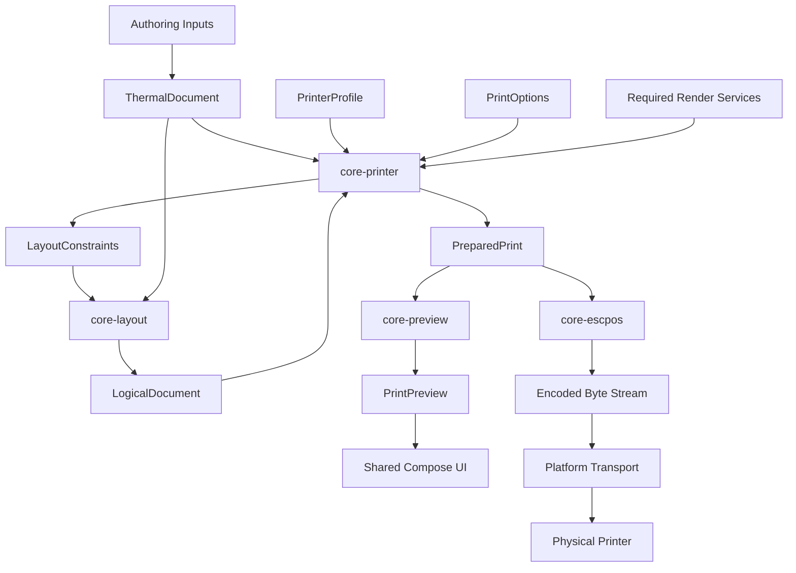

# RastrIO Architecture

**Status:** Implementation Architecture  
**Governing specification:** `PRD.md` v2.1  
**Project:** RastrIO
**License:** Apache-2.0  
**Primary release target:** Android  
**Secondary targets:** Desktop/JVM and Web/Wasm  
**Primary printer protocol family:** ESC/POS-compatible thermal printers

---

## 1. Purpose

This document defines the technical architecture of RastrIO beneath the product and engineering requirements established by `PRD.md`.

It is intended for:

- human contributors;
- maintainers;
- reviewers;
- coding agents such as Codex;
- future contributors adding printer support, UI workflows, transports, or document capabilities.

This document answers the architectural question:

> **Where does a piece of functionality belong, what may it depend on, and what is it forbidden from doing?**

`PRD.md` remains authoritative. This document MUST NOT be used to reinterpret or weaken a requirement in the PRD.

If this document and the PRD disagree, the PRD wins unless both are deliberately updated as part of an architecture change.

Changes affecting any of the following MUST be treated as architecture changes rather than ordinary implementation details:

- architectural invariants;
- portable file formats;
- module ownership;
- dependency direction;
- physical preparation semantics;
- preview/print consistency;
- protocol boundaries;
- transport boundaries;
- platform-neutral API requirements.

---

## 2. Architectural Goals

RastrIO is an offline-first Kotlin Multiplatform application and thermal-printing stack.

The architecture exists to satisfy several goals simultaneously.

### 2.1 Portable document semantics

Documents MUST remain independent of any specific printer, transport, operating system, or printer protocol.

A `.td` document describes the user's content and limited layout intent.

It MUST NOT describe:

- ESC/POS commands;
- Bluetooth addresses;
- USB endpoints;
- transport chunk sizes;
- printer code pages;
- printer-specific raster commands;
- physical strip segmentation generated for a particular device.

### 2.2 Deterministic transformation pipeline

Core transformations SHOULD be deterministic for deterministic inputs.

The architecture is intentionally expressed as transformations:

```text
semantic input
    ↓
logical layout
    ↓
physical printer preparation
    ↓
preview / serialization
```

Each stage has an explicit contract and MUST NOT silently redo work owned by another stage.

### 2.3 One authoritative physical plan

`PreparedPrint` is the authoritative physical output plan.

Physical preview and protocol serialization MUST consume the same `PreparedPrint` value or an equivalent immutable snapshot.

No later stage may independently reinterpret the document.

### 2.4 Portable Core

Core modules MUST remain independent of:

```text
Android
Compose
Bluetooth APIs
USB APIs
browser APIs
desktop APIs
platform file APIs
platform image objects
```

Core contains document and printer intelligence, not operating-system integration.

### 2.5 Shared application and UI

Compose Multiplatform is the default UI implementation.

Application workflow and presentation state SHOULD also remain shared unless a genuine platform constraint requires otherwise.

### 2.6 Platform ownership of platform concerns

The application modules own genuine OS integration.

Examples include:

```text
Bluetooth
USB
file pickers
clipboard
share APIs
browser hardware APIs
runtime permissions
platform lifecycle
platform storage adapters
platform image decoding
```

### 2.7 Android-first delivery

Android is the production priority.

Desktop/JVM is a first-class development target.

Web is architecturally supported but MUST NOT delay Android delivery solely because of Web-specific tooling or browser capability limitations.

---

# 3. System Context

At the highest level:

```text
┌─────────────────────────────────────────────┐
│                 USER                        │
│                                             │
│ Markdown / Templates / Images / Settings   │
└──────────────────────┬──────────────────────┘
                       │
                       ▼
┌─────────────────────────────────────────────┐
│       SHARED PRESENTATION + COMPOSE UI      │
│                                             │
│ State, workflows, navigation, preview UI    │
└──────────────────────┬──────────────────────┘
                       │
                       ▼
┌─────────────────────────────────────────────┐
│                 CORE                        │
│                                             │
│ Document / Text / Layout / Raster /         │
│ Profiles / Preparation / Preview / ESC/POS │
└──────────────────────┬──────────────────────┘
                       │ encoded bytes
                       ▼
┌─────────────────────────────────────────────┐
│             PLATFORM APPLICATION            │
│                                             │
│ OS integrations + printer transports        │
└──────────────────────┬──────────────────────┘
                       │
                       ▼
                Physical Printer
```

The dependency direction is intentionally asymmetric.

Platform applications may use portable code.

Portable code MUST NOT depend on platform applications.

---

# 4. Canonical End-to-End Architecture

The complete physical-print pipeline is:

```text
Authoring Input
    │
    │ Markdown / Template State / resolved image intent
    ▼
ThermalDocument
    │
    │ portable semantic document
    ▼
Printer preparation request
    │
    ├── PrinterProfile
    ├── PrintOptions
    └── required portable render services
    │
    ▼
core-printer
    │
    │ resolves target layout context
    ▼
LayoutConstraints
    │
    ▼
core-layout
    │
    ▼
LogicalDocument
    │
    │ protocol-independent geometry
    ▼
core-printer
    │
    │ resolves physical printer decisions
    ▼
PreparedPrint
    │
    ├──────────────────────────┐
    │                          │
    ▼                          ▼
core-preview               core-escpos
    │                          │
    ▼                          ▼
PrintPreview              encoded byte stream
    │                          │
    ▼                          ▼
Shared Compose UI         platform transport
                               │
                               ▼
                         physical printer
```

Equivalent Mermaid representation:



The important property is not merely the sequence.

The important property is **ownership**.

Each transformation owns a different category of decision.

---

# 5. Architectural Layers of Meaning

RastrIO distinguishes six architectural stages that MUST NOT be collapsed together.

## 5.1 Semantic document representation

Owned primarily by:

```text
core-document
core-markdown
core-templates
```

Primary representation:

```text
ThermalDocument
```

This stage answers:

> What does the document mean?

Examples:

```text
this is a heading
this text is emphasized
this is a checklist
this is an image
this is a table
this is a QR payload
this block is centered
this document prefers landscape orientation
```

It does not answer:

```text
which ESC/POS command should be emitted?
which Bluetooth device is used?
which code page is selected?
how many printer dots wide is the document?
should this line be rasterized?
```

---

## 5.2 Logical layout

Owned by:

```text
core-layout
```

Primary transformation:

```text
ThermalDocument
+
LayoutConstraints
→
LogicalDocument
```

This stage answers:

> Given an explicit logical canvas and typography context, where is the content laid out?

It owns concepts such as:

```text
line breaking
paragraph flow
list indentation
table geometry
logical image placement
alignment
block spacing
logical width
logical orientation
```

It remains protocol-independent.

---

## 5.3 Physical printer preparation

Owned by:

```text
core-printer
```

Primary transformation:

```text
ThermalDocument
+
PrinterProfile
+
PrintOptions
+
required rendering services
→
PreparedPrint
```

This stage answers:

> What exactly should this particular printer physically attempt to produce?

It decides:

```text
printer dimensions
layout constraints derived from the selected target
native versus raster text
printer font selection
code-page selection
raster geometry
image scaling
QR strategy
cut operations
segmentation
overlap
registration marks
printer-specific fallbacks
protocol strategy selection
```

The result is `PreparedPrint`.

---

## 5.4 Preview

Owned by:

```text
core-preview
```

Preview answers:

> How should an already-resolved logical or physical plan be represented for display?

Preview does not make printer decisions.

Two forms exist:

```text
LogicalDocument
→ LogicalPreview
```

and:

```text
PreparedPrint
→ PrintPreview
```

Physical preview MUST NOT perform an independent printer-layout algorithm.

---

## 5.5 Protocol serialization

Owned by:

```text
core-escpos
```

Protocol serialization answers:

> Which bytes represent the already-prepared physical operations?

It converts:

```text
PreparedPrint
→ encoded ESC/POS chunks / stream
```

It does not decide what the printer should print.

---

## 5.6 Transport

Owned by the relevant platform application.

Transport answers:

> How are these already-encoded bytes delivered to the selected physical device?

Examples:

```text
Android Bluetooth RFCOMM
Android USB
Desktop transport
WebUSB
WebSerial
```

Transport MUST NOT understand document semantics.

---

# 6. Core Domain Objects and Their Lifecycle

## 6.1 `ThermalDocument`

`ThermalDocument` is the canonical portable semantic document.

Conceptually:

```kotlin
data class ThermalDocument(
    val schemaVersion: Int,
    val metadata: DocumentMetadata,
    val layout: DocumentLayout,
    val blocks: List<DocumentBlock>,
)
```

The exact Kotlin representation may evolve.

### Ownership

`core-document` owns the model.

Producers include:

```text
core-markdown
core-templates
.td deserialization
other future semantic importers
```

Consumers include:

```text
core-layout
core-printer orchestration
shared presentation
.td serialization
```

### Lifecycle

A `ThermalDocument` is created or loaded, validated, and treated as an immutable semantic snapshot.

Editing state in the UI does not have to mutate an existing `ThermalDocument`.

Instead, editor state MAY produce a new document snapshot whenever compilation occurs.

### Invalidation

Changing semantic content or author-controlled layout intent creates a new logical input and therefore invalidates downstream derived results.

Conceptually:

```text
new ThermalDocument
    ↓
old LogicalDocument invalid
    ↓
old PreparedPrint invalid
    ↓
old preview invalid
```

---

## 6.2 `LayoutConstraints`

`LayoutConstraints` are explicit execution inputs to logical layout.

Conceptually:

```kotlin
data class LayoutConstraints(
    val canvasWidth: Length,
    val orientation: Orientation,
    val typography: TypographyContext,
)
```

The exact model may contain additional fields.

`LayoutConstraints` are not permanent physical printer state stored inside `.td`.

They describe the environment under which a `ThermalDocument` is being laid out.

---

## 6.3 `LogicalDocument`

`LogicalDocument` is the result of resolving semantic content into logical geometry.

```text
ThermalDocument
+
LayoutConstraints
→
LogicalDocument
```

### Ownership

`core-layout` owns creation of `LogicalDocument`.

### Protocol independence

`LogicalDocument` MUST contain no ESC/POS commands and no transport concepts.

However:

> protocol-independent does not mean target-independent.

A selected printer may influence the `LayoutConstraints`.

Therefore the resulting `LogicalDocument` may be target-constrained.

For example:

```text
Printer A printable width
    ↓
LayoutConstraints(canvasWidth = X)
    ↓
LogicalDocument A
```

and:

```text
Printer B printable width
    ↓
LayoutConstraints(canvasWidth = Y)
    ↓
LogicalDocument B
```

may legitimately wrap the same `ThermalDocument` differently.

Neither logical document contains ESC/POS knowledge.

---

## 6.4 `PreparedPrint`

`PreparedPrint` is the authoritative immutable physical intermediate representation.

Conceptually:

```kotlin
data class PreparedPrint(
    val logicalDocument: LogicalDocument,
    val target: PreparedTarget,
    val segments: List<PrintSegment>,
    val diagnostics: List<Diagnostic>,
    val availableAdjustments: AvailableAdjustments,
)
```

Exact fields may change.

### Ownership

`core-printer` owns preparation.

### Completeness rule

If changing a value can alter physical printer output, the relevant decision MUST be represented before `PreparedPrint` is finalized.

Examples include:

```text
font selection
code page
text rasterization
image rasterization
line geometry
QR dimensions
QR native/raster selection
cut behavior
feeds
segment geometry
overlap
registration marks
```

### Downstream contract

Once finalized:

```text
PreparedPrint
    ├──→ core-preview
    └──→ core-escpos
```

Neither consumer may redo physical preparation.

### Invalidation

Any output-affecting change creates a new preparation result.

```text
PrintOptions A
→ PreparedPrint A

PrintOptions B
→ PreparedPrint B
```

The UI MUST NOT mutate or visually patch `PreparedPrint A` to imitate `PreparedPrint B`.

---

# 7. LayoutConstraints and Target-Constrained Logical Layout

One subtle but fundamental RastrIO rule is:

```text
LogicalDocument
```

is protocol-independent but MAY be target-constrained.

This is intentional.

Consider portrait printing.

A printer profile may expose:

```text
printable width
native font geometry
DPI
```

`core-printer` may use those capabilities to resolve:

```text
LayoutConstraints
```

Those constraints are then passed into `core-layout`.

The layout engine is therefore allowed to know:

```text
canvas width
orientation
logical units
typography metrics
layout intent
```

but is forbidden from knowing:

```text
ESC/POS byte sequences
Bluetooth
USB endpoints
RFCOMM
cutter commands
WebUSB
transport chunking
```

This separation permits printer-dependent wrapping without turning the layout engine into a printer-protocol implementation.

### Logical preview without a printer

A logical preview does not require a selected physical printer.

The caller may provide:

```text
document-defined logical width
```

or an:

```text
explicit logical preview preset
```

The caller MUST make that choice explicitly.

`core-layout` MUST NOT silently assume a hard-coded printer width.

---

# 8. Module Architecture

For readability, this document uses names such as `core-document` as shorthand for the planned module located under `core/document/`.

The exact Gradle project paths MAY differ, provided architectural ownership and dependency direction remain intact.

---

## 8.1 `core-document`

### Responsibility

Defines the canonical portable document model and `.td` domain representation.

Owns concepts including:

```text
ThermalDocument
DocumentMetadata
DocumentLayout
LayoutIntent
DocumentBlock
InlineContent
AssetReference
Alignment
Orientation
Dimension / Length
.td serialization model
.td validation
```

### MUST

- use platform-neutral data;
- use immutable domain models by default;
- provide deterministic validation;
- explicitly version schemas;
- use stable node discriminators;
- enforce `.td` structural invariants;
- enforce the `.td` specification even when the selected JSON/archive library is more permissive;
- reject format-invalid input such as duplicate JSON keys, unknown v1 properties, unsupported discriminators, prohibited lenient JSON forms, and resource-limit violations;
- avoid hidden I/O.

The portable format specification is authoritative over parser-library behavior. If a dependency does not enforce a required rule directly, `core-document` MUST apply bounded pre-validation, parser wrapping, or structural validation rather than silently widening the accepted `.td` format.

### MUST NOT know about

```text
printers
DPI
ESC/POS
Bluetooth
USB
code pages
transport chunking
Compose
Android APIs
```

---

## 8.2 `core-markdown`

### Responsibility

Compiles GitHub Flavored Markdown into `ThermalDocument`.

```text
Markdown
    ↓
GFM parser
    ↓
Markdown AST
    ↓
RastrIO compiler
    ↓
ThermalDocument + Diagnostics
```

### MUST own

- Markdown semantic mapping;
- supported GFM construct handling;
- Markdown-specific diagnostics;
- conversion of image references into `AssetReference` or unresolved diagnostic state;
- v1 raw/unsupported HTML handling.

For v1, raw or unsupported HTML MUST be preserved as literal document text where the parser can expose the significant source safely, accompanied by a structured warning such as `MD101 Unsupported raw HTML`.

`core-markdown` MUST NOT execute, interpret, sanitize-and-render, or otherwise treat HTML tags, attributes, scripts, styles, event handlers, or embedded markup as active HTML. Significant unsupported HTML MUST NOT silently disappear. If safe literal preservation is unavailable for a construct, compilation MUST produce a structured diagnostic instead of dropping it.

### MUST NOT

- resolve printer width;
- know printer DPI;
- select code pages;
- resolve Bluetooth or USB;
- perform physical segmentation;
- emit ESC/POS;
- fetch remote assets;
- open Markdown-referenced files implicitly.

---

## 8.3 `core-templates`

### Responsibility

Converts structured template state directly into `ThermalDocument`.

Examples:

```text
ShoppingListState
→ ShoppingListDocumentBuilder
→ ThermalDocument
```

```text
MemoState
→ MemoDocumentBuilder
→ ThermalDocument
```

Template implementations MUST NOT generate Markdown merely as an intermediate representation.

Templates are semantic document producers.

They are not alternate layout or printer engines.

---

## 8.4 `core-text`

### Responsibility

Owns portable text measurement and rendering contracts needed by layout and printer preparation.

Conceptual types may include:

```text
TextStyle
TextMetrics
TypographyContext
FontMetrics
GlyphCoverage
TextMeasurement
TextLine
TextRun
ShapedText
RasterTextRequest
RasterTextResult
```

### Distinct concepts

The implementation MUST distinguish:

```text
native printer text metrics
raster text metrics
preview representation
```

These are not interchangeable.

### Platform-backed shaping

If shaping or rasterization requires platform-specific implementation, `core-text` MAY expose a narrow portable service contract.

For example:

```kotlin
interface TextRasterizer {
    fun rasterize(
        request: RasterTextRequest
    ): RasterTextResult
}
```

The interface MUST use platform-neutral inputs and outputs.

The following MUST NOT cross the boundary:

```text
android.graphics.Paint
android.graphics.Bitmap
Compose TextLayoutResult
Skia handles
browser canvas objects
native platform font handles
```

Text shaping MUST be complete before final `PreparedPrint` creation.

Preview and ESC/POS serialization MUST NOT reshape text.

---

## 8.5 `core-layout`

### Responsibility

Transforms semantic documents into logical geometry.

```text
ThermalDocument
+
LayoutConstraints
→
LogicalDocument
```

Owns:

```text
block flow
paragraph flow
vertical semantic spacing
line breaking
list indentation
alignment
table layout
code layout
image placement
QR placeholder placement
portrait logical layout
landscape logical layout
```

### MUST NOT own

```text
code-page selection
native/raster printer strategy
ESC/POS
Bluetooth
USB
cutter bytes
transport buffering
printer connection state
```

---

## 8.6 `core-raster`

### Responsibility

Provides deterministic portable image processing and monochrome raster operations.

Pipeline:

```text
DecodedImage
    ↓
orientation normalization
    ↓
crop
    ↓
resize
    ↓
grayscale
    ↓
brightness / contrast / gamma
    ↓
threshold / dithering
    ↓
1-bit raster
```

Initial algorithms include:

```text
Threshold
Bayer
Atkinson
Floyd–Steinberg
```

### Requirements

`core-raster` MUST:

- operate on portable pixel/image representations;
- produce deterministic output for deterministic inputs;
- correctly handle widths not divisible by eight;
- define bit order explicitly;
- define deterministic padding bits;
- support bands or tiles for large output;
- avoid requiring one print-job-wide raster allocation.

Image-file decoding itself is outside this module.

---

## 8.7 `core-profile`

### Responsibility

Defines portable printer capabilities and validated protocol strategy configuration.

Owns:

```text
PrinterProfile
.tcfg parsing
.tcfg validation
profile overrides
capability models
ProtocolProfile
registered protocol dialect/strategy compatibility metadata
known quirk identifiers
```

The protocol-family-level portable model is `ProtocolProfile`. For `.tcfg` schema v1, the only variant is conceptually `EscPosProtocolProfile`, which carries the ESC/POS `dialectId` and initialization strategy. A future protocol family adds a future validated variant and trusted encoder rather than widening `core-escpos` with model-name branches.

Capabilities may describe:

```text
DPI
printable width
native fonts
font geometry
native styles
code pages
raster support
QR support
barcode support
cutter support
printer buffer guidance
preferred raster band size
status-query support
known quirks
```

### Hardware behavior rule

Printer-specific behavior MUST be data-driven where the PRD defines it as a profile concern.

Generic Core code MUST NOT accumulate conditions such as:

```kotlin
if (printerModel == "H50i") {
    ...
}
```

when that behavior belongs in a capability, quirk, or validated strategy.

### Security

A normal `.tcfg` profile MUST NOT contain arbitrary executable printer programs or unrestricted raw command templates.

Profiles select validated known strategies and parameters.

The `.tcfg` specification is authoritative over parser-library behavior. `core-profile` MUST reject format-invalid input even when the selected JSON library would otherwise accept it, including duplicate keys, unknown v1 fields, unregistered identifiers, prohibited lenient JSON forms, and resource-limit violations.

### Evidence gating

A maintained production profile MUST contain only output-affecting capabilities supported by evidence appropriate to the claim.

For the currently available H50i reference device, generic Epson documentation, nominal media width, product marketing material, manufacturer/model naming, or behavior observed in an unrelated application MUST NOT by itself establish:

```text
printable dot width
DPI
native font metrics
code pages
raster strategy
QR/barcode behavior
cutter behavior
status-query behavior
printer buffering
printer pacing
firmware quirks
```

Unverified values MAY exist in a clearly marked development profile or evidence worksheet, but MUST NOT be promoted silently into the maintained production profile.

---

## 8.8 `core-printer`

### Responsibility

Owns physical printer preparation.

It also owns the portable `PreparedPrint` domain model and prepared-operation types consumed by `core-preview` and `core-escpos`.

`core-printer` MUST NOT depend on `core-preview` or `core-escpos`.

Canonical process:

```text
ThermalDocument
+
PrinterProfile
+
PrintOptions
+
required rendering services
    ↓
PreparationEngine
    ↓
resolve LayoutConstraints
    ↓
core-layout
    ↓
LogicalDocument
    ↓
physical strategy resolution
    ↓
PreparedPrint
```

`core-printer` owns decisions including:

```text
physical dimensions
dot conversion
layout-constraint resolution
native/raster text strategy
printer font selection
code-page selection
Unicode fallback
image sizing
image raster resolution
QR strategy
barcode strategy
physical segmentation
segment overlap
registration marks
segment numbering
manual cut guides
automatic cut operations
printer-specific diagnostics
protocol-strategy selection
```

### Bounded immutable prepared data

`PreparedPrint` immutability does not require every prepared raster byte to be retained in one in-memory object graph.

For large jobs, a prepared raster operation MAY reference an immutable prepared artifact through a portable Core contract. The backing implementation MAY use:

```text
bounded in-memory bands
application-controlled temporary/spool storage
another deterministic immutable chunk store
```

The contract is normative:

1. all output-affecting preparation is complete before `PreparedPrint` is finalized;
2. prepared artifact identity, dimensions, ordering, and content remain stable for the lifetime of that `PreparedPrint`;
3. consumers receive read-only access;
4. `core-preview` and `core-escpos` consume the same finalized content or an equivalent immutable snapshot;
5. downstream consumers MUST NOT re-run shaping, resizing, dithering, rasterization, segmentation, or other output-affecting preparation;
6. platform file objects and attacker-controlled paths MUST NOT appear in portable Core APIs;
7. spool/temp resources are bounded, application-controlled, cancellation-aware, and explicitly cleaned up;
8. if finalized prepared data can no longer be read, that preparation is invalid and MUST fail rather than being silently regenerated.

### MUST NOT

- open Bluetooth sockets;
- claim USB interfaces;
- request Android permissions;
- display UI;
- write bytes to hardware.

---

## 8.9 `core-preview`

### Responsibility

Creates portable preview models from already-resolved Core output.

Two distinct paths exist.

Logical preview:

```text
LogicalDocument
→ LogicalPreview
```

Physical preview:

```text
PreparedPrint
→ PrintPreview
```

### Physical preview requirements

For raster content, preview SHOULD represent the exact raster data to be encoded.

For native printer text, preview MUST preserve authoritative:

```text
wrapping
line placement
alignment
operation geometry
style intent
image placement
QR placement
feed/cut semantics
```

Exact native glyph appearance is only guaranteed when an exact printer font model exists.

Otherwise representative glyph rendering MAY be used while preserving resolved geometry.

### MUST NOT

- call layout again to obtain different geometry;
- choose native versus raster rendering;
- select code pages;
- re-dither images;
- re-rasterize finalized prepared text/images merely because prepared data is chunked or spooled;
- invent physical cut behavior.

When a `PreparedPrint` references bounded prepared artifacts, `core-preview` reads those finalized artifacts through the portable read-only contract. It MUST NOT treat the storage mechanism as permission to recreate the output.

---

## 8.10 `core-escpos`

### Responsibility

Serializes `PreparedPrint` into ESC/POS-compatible bytes.

```text
PreparedPrint
    ↓
EscPosEncoder
    ↓
encoded byte chunks / stream
```

### MAY

- emit initialization commands;
- serialize prepared native-text operations;
- serialize selected code pages;
- serialize prepared raster bands;
- serialize already-selected QR operations;
- serialize feed operations;
- serialize cut operations;
- emit command sequences corresponding to validated protocol strategies.

### MUST NOT

```text
re-layout
re-wrap
re-shape
select a code page
resize images
dither images
recompute tables
change QR dimensions
select native/raster strategy
re-segment landscape output
change overlap
invent cut decisions
```

If an operation cannot be serialized consistently, `core-escpos` MUST return a structured diagnostic rather than silently changing the physical plan.

When a prepared raster operation references bounded prepared artifacts, the encoder streams the finalized artifact content. It MUST NOT recreate raster data or invoke image/text rendering in order to serialize it.

---

# 9. Shared Application Architecture

The `shared/` module contains two conceptually separate layers:

```text
Shared Presentation
Shared Compose UI
```

It also owns portable application-state models that are neither printer capability data nor platform API objects, including the application-level `PrinterInstance` model.

They may live in the same Gradle module initially, but contributors MUST preserve the distinction in code organization.

A shared application-state model MUST remain platform-neutral even when it stores an opaque persisted locator or identity value used later by a platform adapter.

---

# 10. Shared Presentation

Shared Presentation owns application workflows and state coordination.

Conceptual state models include:

```text
DocumentSession
MarkdownEditorState
TemplateEditorState
PrinterSelectionState
PrintConfigurationState
PreviewState
PrintJobState
RecentDocumentsState
```

Conceptual controllers/use cases may include:

```text
DocumentController
AssetController
PreviewController
PrinterController
PrintController
```

Names are non-normative.

Responsibilities are normative.

### Presentation MAY

- react to user events;
- invoke Markdown compilation;
- invoke template builders;
- request asset resolution;
- request image decoding;
- choose the current printer instance;
- load the relevant printer profile;
- construct current `PrintOptions`;
- request preparation;
- request logical or physical preview;
- initiate encoding;
- coordinate a transport session;
- expose progress and diagnostics to UI.

### Presentation MUST NOT implement

```text
Markdown semantics
layout algorithms
dithering
printer strategy selection
code-page selection
ESC/POS encoding
printer capability validation
```

Presentation coordinates those components.

It does not duplicate them.

---

# 11. Shared Compose Multiplatform UI

Compose Multiplatform is the default UI layer for:

```text
Android
Desktop
Web
```

Shared screens include, as applicable to implementation phase:

```text
HomeScreen
MarkdownScreen
TemplateScreen
ImagePrintScreen
PreviewScreen
PrinterScreen
PrinterProfileScreen
PrinterLabScreen
SettingsScreen
```

Reusable components may include:

```text
PaperPreview
PhysicalStripPreview
PrinterSelector
DiagnosticBanner
TemplateCard
DitheringSelector
PrintOptionsPanel
PrintProgress
```

### UI responsibility

Compose renders application state.

It does not define Core truth.

For example:

```text
PreparedPrint
    ↓
core-preview
    ↓
PrintPreview
    ↓
Compose rendering
```

is valid.

The following is not:

```text
PreparedPrint
    ↓
Compose performs its own wrapping
    ↓
display
```

### Platform-specific screen copies

Ordinary screens MUST NOT be duplicated as:

```text
AndroidPreviewScreen
DesktopPreviewScreen
WebPreviewScreen
```

unless there is a documented platform requirement that prevents reasonable shared implementation.

Preferred:

```text
shared Composable
+
portable presentation state
+
platform service contract
+
platform implementation
```

---

# 12. Platform Applications

## 12.1 `androidApp`

Android is the primary production application.

It owns genuine Android integration, including:

```text
application entry point
Compose host
Android lifecycle
Storage Access Framework
file picker integration
runtime permissions
clipboard
share intents
Android storage adapters
image decoding adapter
external asset policy implementation
Bluetooth discovery
Bluetooth transport
USB discovery
USB transport
PrinterInstance persistence adapter
resolution of persisted transport locators into Android device/session objects
```

The portable application-level `PrinterInstance` model belongs to `shared`. Android owns the adapter that persists it and resolves its platform-neutral transport locator into live Android Bluetooth/USB objects.

Android Bluetooth and USB code belongs in `androidApp`.

It MUST NOT be moved into generic Core merely to make it reusable.

---

## 12.2 `desktopApp`

Desktop/JVM is initially a first-class development target rather than a requirement for hardware-print parity with Android.

Its early purpose includes:

```text
rapid shared UI development
Markdown development
template development
layout development
preview development
printer-profile development
debugging
fixture generation
ESC/POS inspection/export testing
```

Windows and Linux are the primary intended desktop environments.

Desktop hardware transports MAY be added later when justified.

The absence of early desktop hardware printing MUST NOT cause platform behavior to leak into Core.

---

## 12.3 `webApp`

Web is a later product target.

Before the dedicated Web phase, it SHOULD remain structurally healthy where practical.

Web architecture MUST preserve:

```text
shared Core
shared Presentation
shared Compose UI
```

Future platform implementations may include:

```text
browser file APIs
browser storage
clipboard
WebUSB
WebSerial
browser permission handling
```

Hardware support MUST use capability detection.

The application MUST NOT assume WebUSB or WebSerial exists.

Web limitations MUST NOT cause `ThermalDocument`, `LogicalDocument`, `PreparedPrint`, or general Core architecture to fork.

A Web-only toolchain or browser limitation MUST NOT block Android delivery before Web becomes a required project gate.

---

# 13. Platform-Neutral API Rules

Any API crossing into portable Core MUST expose portable values.

Acceptable examples include:

```text
String
ByteArray
Int
Long
Boolean
portable enums
immutable Kotlin domain models
portable pixel buffers
portable dimensions
portable diagnostics
```

Subject to resource limits, other ordinary KMP-compatible value types MAY be used.

Portable Core APIs MUST NOT expose types such as:

```kotlin
android.graphics.Bitmap
android.graphics.Paint
android.net.Uri
android.bluetooth.BluetoothDevice
android.hardware.usb.UsbDevice
android.content.Context
androidx.compose.*
java.awt.Image
browser DOM elements
browser Canvas objects
native Skia handles
```

Platform types MUST be converted at the platform boundary.

---

# 14. `expect` / `actual` Versus Service Interfaces

Kotlin Multiplatform supports both `expect`/`actual` declarations and injected service interfaces.

They serve different architectural purposes.

RastrIO SHOULD prefer explicit interfaces/adapters for operations involving state, policy, I/O, permissions, external resources, or replaceable behavior.

Examples:

```text
FileService
ClipboardService
ShareService
PlatformStorage
ImageDecodeService
ExternalAssetResolver
PrinterDiscoveryService
PrinterTransport
TextRasterizer
```

These are observable services with behavior that should be injectable, testable, and fakeable.

### Prefer a service interface when functionality:

- performs I/O;
- interacts with hardware;
- requests permissions;
- has lifecycle or connection state;
- has failure modes that need testing;
- depends on user or application policy;
- may need a fake implementation;
- has multiple implementations on one platform;
- is injected into Core or Presentation.

### `expect` / `actual` MAY be appropriate for

small platform implementation details whose platform distinction is compile-time structural rather than an application service.

Examples might include narrowly scoped platform factories, platform constants, or other implementation shims where dependency injection would add no meaningful testability or policy boundary.

### `expect` / `actual` MUST NOT be used to

- hide network access inside Core;
- hide filesystem access inside Core;
- smuggle Android types into portable APIs;
- implement printer transport inside Core;
- bypass explicit service injection where the service has meaningful lifecycle or test behavior;
- create effectively global platform services that make deterministic Core transformations depend on hidden environment state.

The default rule is:

> **Operations are adapters; small structural differences may be `expect`/`actual`.**

No abstraction SHOULD be introduced solely because another platform might theoretically require it in the future.

---

# 15. PrinterProfile, PrinterInstance, and PrintOptions

These concepts MUST remain distinct.

## 15.1 `PrinterProfile`

A `PrinterProfile` describes a printer model or capability set.

It is:

```text
portable
shareable
importable
exportable
hardware-capability focused
```

It MUST NOT contain user-private paired-device identity.

Typical information includes:

```text
printable width
DPI
font geometry
native styles
code pages
raster strategies
QR capabilities
cutter capabilities
printer-side buffering guidance
protocol dialect
known quirks
```

---

## 15.2 `PrinterInstance`

A `PrinterInstance` represents a particular physical printer known to the user.

The portable application-level model belongs to `shared`, not `core-profile`.

It may contain platform-neutral local application state such as:

```text
application-local instance id
display name
transport kind
opaque persisted transport locator / device identity
associated PrinterProfile id/revision
validated user overrides
transport/session preferences
last-used metadata
```

It MUST NOT contain live platform objects such as:

```text
Android BluetoothDevice / BluetoothSocket
Android UsbDevice / UsbInterface / UsbEndpoint
browser USB/serial handles
desktop serial-port objects
open sockets
file descriptors
platform permission objects
```

Platform applications own discovery, permissions, conversion between the persisted locator and platform device/session objects, connection lifecycle, and persistence-adapter implementation.

This information is not portable printer-profile data.

A `.tcfg` MUST NOT contain personal paired-device identity.

`PrinterInstance` MUST NOT be serialized as `.tcfg`.

---

## 15.3 `PrintOptions`

`PrintOptions` represents user-selected choices for one preparation operation.

Examples include:

```text
dithering algorithm
brightness
contrast
gamma
density
text strategy
image scaling strategy
landscape overlap
registration marks
strip numbers
manual cut guides
native/raster preference
QR strategy preference
```

`PrintOptions` are not printer capabilities.

They express user intent within the capabilities of the selected printer.

---

## 15.4 Effective preparation inputs

Conceptually:

```text
PrinterProfile
+
validated PrinterInstance overrides
    ↓
EffectivePrinterProfile

EffectivePrinterProfile
+
ThermalDocument
+
PrintOptions
+
render services
    ↓
PreparedPrint
```

User overrides MUST NOT bypass profile validation or protocol safety.

---

# 16. Printer Constraints Versus Transport Constraints

Printer limitations and transport limitations are separate architectural concerns.

## 16.1 Printer constraints

`PrinterProfile` may describe:

```text
recommended raster band height
printer-side buffer limitations
printer pacing guidance
printable dimensions
supported command strategies
```

These describe characteristics of the printer.

---

## 16.2 Transport constraints

A transport/session may describe:

```text
safe write chunk size
connection buffering
write timeout
connection pacing
flush behavior
```

These describe delivery of bytes.

---

## 16.3 Intersection

Actual transmission may need to respect both.

Conceptually:

```text
printer guidance
+
transport/session constraints
    ↓
safe transmission policy
```

However:

```text
raster band
≠
transport write chunk
```

A prepared raster operation might contain a printer-safe band that is subsequently transmitted across several Bluetooth writes.

Changing Bluetooth write size MUST NOT trigger:

```text
new layout
new rasterization
new PreparedPrint
```

Changing a printer capability that affects physical output may.

---

# 17. Asset Resolution Architecture

Asset handling crosses semantic, application, decoding, and raster boundaries.

The boundaries MUST remain explicit.

## 17.1 Markdown compilation

Given:

```markdown

```

`core-markdown` produces:

```text
AssetReference
```

and/or an appropriate diagnostic.

It does not perform network access.

---

## 17.2 Presentation policy

Higher-level application logic decides whether an external asset may be resolved.

Conceptually:

```text
AssetReference
    ↓
AssetController
    ↓
ExternalAssetResolver
```

Resolution may result in:

```text
resolved bytes
rejected asset
unresolved asset
diagnostic
```

Network access MUST be explicit and policy-controlled.

---

## 17.3 Decoding

Encoded image bytes are passed to:

```text
ImageDecodeService
```

which converts them into a portable decoded representation.

```text
PNG / JPEG / WebP / platform image source
    ↓
ImageDecodeService
    ↓
DecodedImage
```

---

## 17.4 Raster processing

Only after decode:

```text
DecodedImage
    ↓
core-raster
```

Platform image classes MUST NOT cross into `core-raster`.

---

## 17.5 Saving self-contained `.td`

When the user chooses a self-contained document, resolved assets may be embedded according to `.td` save policy and resource limits.

A print operation MUST NOT unexpectedly depend on unresolved remote content.

---

# 18. Image Decoding Boundary

Image format decoding is distinct from thermal raster processing.

`core-raster` does not need to understand:

```text
PNG container parsing
JPEG decoding
WebP decoding
Android BitmapFactory
browser ImageBitmap
desktop image APIs
```

A platform or appropriately portable decoding adapter produces:

```text
DecodedImage
```

The portable result then enters deterministic Core processing.

Conceptually:

```text
platform source
    ↓
ImageDecodeService
    ↓
DecodedImage
    ↓
core-raster
    ↓
processed monochrome data
    ↓
core-printer
    ↓
PreparedPrint raster operations
```

Decode-time resource validation MUST occur before or during potentially dangerous allocations.

---

# 19. Text Rendering and Shaping Boundary

Text rendering is divided into four concerns.

```text
semantic text
    ↓
text measurement
    ↓
logical layout
    ↓
physical native/raster decision
    ↓
final prepared text operation
```

`core-text` owns the shared contracts.

`core-layout` uses text metrics to determine logical geometry.

`core-printer` determines whether the selected target can reliably emit that text natively.

Where native printing is not reliable, preparation may invoke text shaping/rasterization.

### Initial fallback rule

If a resolved physical line requires raster text because it cannot be reliably represented natively, the complete physical line may be rasterized.

Per-glyph native/raster mixing is not required initially.

### Re-layout

Raster fallback MUST NOT silently invalidate finalized geometry.

If raster metrics differ enough to alter layout:

```text
detect fallback requirement
    ↓
resolve correct typography/layout inputs
    ↓
run layout again as required
    ↓
finalize PreparedPrint
```

After `PreparedPrint` exists:

```text
no shaping
no line reflow
no glyph strategy change
```

is permitted downstream.

---

# 20. Diagnostics Architecture

Major stages SHOULD return structured diagnostics instead of silently dropping or corrupting significant content.

Conceptually:

```kotlin
data class Diagnostic(
    val code: String,
    val severity: Severity,
    val message: String,
    val sourceLocation: SourceLocation?,
)
```

Potential namespaces include:

```text
TDxxx   document/archive
MDxxx   Markdown
TXTxxx  text/rendering
LAYxxx  layout
IMGxxx  image/raster
PRFxxx  profile
PRNxxx  printer preparation
PRVxxx  preview-owned failures
ESCxxx  ESC/POS
TRNxxx  transport/session
```

## 20.1 Flow

Conceptually:

```text
Core stage
    ↓
Diagnostic(s)
    ↓
Shared Presentation
    ↓
Preview / workflow state
    ↓
Shared UI
```

Platform transport errors similarly become transport diagnostics or structured failure states surfaced through presentation.

### Severity

Warnings MAY allow an operation to continue.

Fatal diagnostics MUST prevent the affected operation.

### Privacy

Diagnostic text and logging MUST avoid including printable user content unless it is specifically required for local user-facing explanation.

Machine-oriented logs SHOULD prefer:

```text
diagnostic code
profile ID
operation type
dimensions
band size
byte count
connection state
```

over document content.

---

# 21. Print Job Lifecycle Boundary

Printing is an explicit workflow, not a single opaque `print()` call.

Baseline states:

```text
CREATED
    ↓
PREPARING
    ↓
READY
    ↓
CONNECTING
    ↓
PRINTING
    ↓
COMPLETED
```

Terminal alternatives:

```text
FAILED
CANCELLED
```

## 21.1 Ownership

The portable application workflow/state representation belongs with shared presentation.

Individual platform transport implementations own their actual connection and write operations.

Conceptually:

```text
Shared PrintController / PrintJobState
    │
    ├── preparation request → Core
    │
    ├── encoding request → core-escpos
    │
    └── transmission request → platform PrinterTransport
```

The platform reports events/results back to shared orchestration.

### Meaning of completion

`COMPLETED` means RastrIO successfully transmitted the intended bytes according to the transport contract.

It does not necessarily prove that physical paper output occurred successfully.

The UI MUST NOT claim stronger confirmation unless supported by reliable printer status behavior.

---

## 21.2 Partial transmission

Failures may occur after output has begun.

Failure information SHOULD be capable of representing concepts such as:

```text
bytesAttempted
bytesTransmitted
outputMayHaveOccurred
failureStage
```

Exact model fields may differ.

### Retry invariant

If output may already have partially occurred, RastrIO MUST NOT automatically retry the job.

A user-controlled retry MAY be offered after warning that duplicate or partial output is possible.

---

# 22. Immutable Domain Model Expectations

Portable domain values SHOULD be immutable by default.

This applies especially to:

```text
ThermalDocument
LogicalDocument
PrinterProfile
EffectivePrinterProfile
PrintOptions
PreparedPrint
PrintPreview
Diagnostic
```

Implementation guidelines:

- expose values rather than mutable internal state;
- prefer `val` properties;
- do not expose mutable collections as domain APIs;
- create new values for semantic changes;
- do not rely on object mutation to invalidate caches;
- keep derived values reproducible from explicit inputs.

Immutability is particularly important for `PreparedPrint`.

Once a `PreparedPrint` is supplied to preview or encoding, no concurrent UI change may mutate what that value means.

---

# 23. Deterministic Core Transformations

Where practical, Core SHOULD behave as a pure transformation system.

Examples:

```text
Markdown
→ ThermalDocument

Template State
→ ThermalDocument

ThermalDocument + LayoutConstraints
→ LogicalDocument

ThermalDocument + PrinterProfile + PrintOptions
→ PreparedPrint

PreparedPrint
→ PrintPreview

PreparedPrint
→ ESC/POS bytes
```

For identical controlled inputs, these transformations SHOULD produce identical semantically relevant output.

Sources of variation MUST NOT be hidden.

For example, behavior that depends on:

```text
font metrics
printer width
code-page capability
dithering algorithm
rendering strategy
```

must receive that information through explicit inputs, controlled resources, or injected service contracts.

Golden tests are required where exact output is part of the contract.

---

# 24. Dependency Rules

## 24.1 Global dependency direction

The high-level dependency direction is:

```text
Platform Apps
      ↓
    shared
      ↓
    core-*
```

Core dependency relationships then flow toward lower-level portable domain modules.

A dependency MUST NOT be reversed merely because doing so is convenient for one feature.

---

## 24.2 Normative Core relationships

In this section:

```text
A → B
```

means **module A depends on module B**.

The Phase 0 baseline is:

```text
core-markdown  → core-document
core-templates → core-document

core-layout    → core-document
core-layout    → core-text

core-printer   → core-layout
core-printer   → core-profile
core-printer   → core-raster
core-printer   → core-text

core-preview   → core-layout
core-preview   → core-printer

core-escpos    → core-printer
core-escpos    → core-profile
                 only where encoder-visible registered strategy/protocol
                 value types are owned by core-profile
```

`core-printer` owns `PreparedPrint` and prepared-operation types.

`core-preview` and `core-escpos` are downstream consumers of the physical plan. They MUST NOT become dependencies of `core-printer`.

The exact Gradle project paths and `api`/`implementation` exposure MAY vary where required by Kotlin/Gradle mechanics, but ownership and dependency direction are normative.

---

## 24.3 Allowed dependency examples

Allowed:

```text
core-markdown → core-document
```

because Markdown produces `ThermalDocument`.

Allowed:

```text
core-layout → core-document
core-layout → core-text
```

because layout consumes document semantics and text metrics.

Allowed:

```text
core-printer → core-profile
core-printer → core-layout
core-printer → core-raster
```

because preparation consumes printer capabilities and invokes layout/raster operations.

Allowed:

```text
core-preview → core-printer
core-escpos → core-printer
```

because preview and protocol serialization consume `PreparedPrint` owned by `core-printer`.

Allowed:

```text
shared → core-markdown
shared → core-printer
shared → core-preview
```

because shared presentation orchestrates Core.

Allowed:

```text
androidApp → shared
androidApp → portable Core where integration requires it
```

because Android hosts the shared app and supplies platform implementations.

Allowed:

```text
androidApp Bluetooth transport
```

to implement the shared `PrinterTransport` contract.

---

## 24.4 Forbidden dependency examples

Forbidden:

```text
core-document → core-printer
```

A portable semantic document cannot depend on printers.

Forbidden:

```text
core-layout → core-escpos
```

Logical layout cannot depend on protocol encoding.

Forbidden:

```text
core-markdown → androidApp
```

Markdown compilation cannot depend on Android.

Forbidden:

```text
core-raster → Compose
```

Raster processing cannot depend on UI.

Forbidden:

```text
core-printer → android.bluetooth.*
```

Physical preparation cannot open Bluetooth connections.

Forbidden:

```text
core-printer → core-preview
core-printer → core-escpos
```

Preparation owns the physical plan and MUST NOT depend on downstream consumers.

Forbidden:

```text
core-escpos → BluetoothPrinterTransport
```

Serialization cannot control transport.

Forbidden:

```text
core-* → shared
```

Core may not depend on the application layer.

Forbidden:

```text
shared → androidApp
```

Portable shared presentation/UI cannot depend on an Android application module.

Forbidden:

```text
webApp → androidApp
```

Platform application modules must not depend on each other to obtain shared behavior.

Forbidden:

```text
core-preview → Compose
```

Preview models must remain portable.

Forbidden:

```text
PrinterTransport → ThermalDocument
```

Transport sends bytes; it does not understand documents.

---

## 24.5 Circular dependencies

Circular Gradle dependencies are forbidden.

If two modules appear to require each other, contributors MUST first inspect whether:

- a model belongs at a lower architectural layer;
- a narrow portable contract is required;
- orchestration belongs in `shared`;
- responsibilities have accidentally been duplicated.

A circular dependency MUST NOT be solved by merging unrelated architectural responsibilities without review.

A generic catch-all module such as `core-common` or `core-model` MUST NOT be introduced merely to bypass dependency ownership. A new shared Core module requires a concrete cohesive responsibility and architecture review.

---

# 25. Data and Control Flow

An important distinction is the direction of data versus orchestration.

Shared Presentation initiates workflows.

Core performs transformations.

Platform code performs integration.

For example:

```text
User presses Print
    ↓
Shared Presentation
    ↓
load selected PrinterInstance / profile
    ↓
construct PrintOptions
    ↓
core-printer
    ↓
PreparedPrint
    ↓
core-preview
    ↓
UI displays physical preview
    ↓
user confirms
    ↓
core-escpos
    ↓
encoded chunks
    ↓
platform PrinterTransport
```

The fact that Presentation controls the sequence does not give Presentation ownership of the algorithms inside it.

---

# 26. Preview Architecture

Preview has two distinct use cases.

## 26.1 Logical preview

```text
ThermalDocument
+
explicit logical preview constraints
    ↓
core-layout
    ↓
LogicalDocument
    ↓
core-preview
    ↓
LogicalPreview
```

This is useful before printer selection and during authoring.

---

## 26.2 Physical preview

```text
PreparedPrint
    ↓
core-preview
    ↓
PrintPreview
```

This is authoritative for the prepared physical geometry.

The platform application MUST NOT recreate printer layout.

The Compose UI MUST render the preview model rather than becoming a second layout engine.

---

# 27. Preview/Print Consistency Contract

The following relationship is non-negotiable:

```text
                 PreparedPrint
                 /           \
                /             \
               ▼               ▼
        PrintPreview       ESC/POS bytes
```

An output-affecting UI change triggers:

```text
new PrintOptions
    ↓
new preparation
    ↓
new PreparedPrint
    ↓
new PrintPreview
```

It MUST NOT trigger:

```text
modify Preview composable only
```

or:

```text
modify encoder behavior only
```

without creating a new corresponding physical plan.

---

# 28. Transport Architecture

There is no required global platform-implementation transport module.

Each platform owns its transport implementation.

```text
shared
    └── PrinterTransport contract

androidApp
    ├── BluetoothPrinterTransport
    └── UsbPrinterTransport

desktopApp
    └── DesktopPrinterTransport, when implemented

webApp
    ├── WebUsbPrinterTransport
    └── WebSerialPrinterTransport
```

A transport may know:

```text
connection state
byte chunks
write operations
timeouts
flush semantics
disconnect
transport errors
byte counts
```

A transport MUST NOT know:

```text
Markdown
ThermalDocument
tables
QR semantics
image semantics
layout
dithering
code-page selection
printer strategy selection
```

---

# 29. Extension Strategy for Future Printer Protocols

RastrIO's current primary protocol implementation is ESC/POS.

The architecture MUST support future evolution without prematurely building a generic multi-protocol framework that has no second real consumer.

## 29.1 Current rule

Keep:

```text
core-escpos
```

explicitly ESC/POS-specific.

Do not rename it to a vague abstraction such as:

```text
core-protocol
core-printer-language
universal-encoder
```

without a demonstrated second protocol family.

---

## 29.2 Protocol-neutral boundaries that already exist

The architecture already separates:

```text
ThermalDocument
LogicalDocument
printer capabilities
physical preparation
transport
```

from ESC/POS serialization.

These boundaries are sufficient to permit future protocol work.

---

## 29.3 Adding a future protocol

If a real second printer language is introduced, contributors SHOULD first determine which prepared operations are genuinely protocol-neutral.

Only then should shared abstractions be extracted.

A likely evolution could conceptually become:

```text
PreparedPrint
    ├──→ core-escpos
    └──→ future protocol encoder
```

provided `PreparedPrint` can represent the required physical plan without encoding ESC/POS command bytes.

The architecture MUST NOT be generalized speculatively before this is required.

---

## 29.4 Profile interaction

`PrinterProfile` identifies a protocol family through the validated `.tcfg` `protocol` block.

For schema v1:

```text
protocol.family = escpos
```

is the only normative family.

Architecturally, the protocol field is a tagged family boundary:

```text
PrinterProfile
    └── protocol: ProtocolProfile
            ├── ESC/POS family      // v1
            └── future family       // future schema/specification
```

The internal fields of a future family MAY differ from ESC/POS dialect/initialization fields. The family-specific schema and encoder remain trusted RastrIO implementation behavior.

Profiles MUST continue to choose among safe, known strategies.

An unsupported family MUST fail validation; it MUST NOT fall back to ESC/POS.

Future protocol support MUST NOT turn `.tcfg` into an arbitrary executable command-template format.

---

# 30. Desktop as a Development Target

Desktop/JVM has strategic architectural value even before desktop hardware printing exists.

It SHOULD provide a fast environment for:

```text
shared UI work
Markdown compilation
layout development
preview development
profile development
debugging
golden fixture inspection
ESC/POS export or inspection
```

Desktop therefore SHOULD continue compiling during normal development and SHOULD remain useful as the rapid shared-UI development environment.

This does not change release priority.

Android remains the primary production workflow.

A desktop convenience feature MUST NOT cause Android architecture to become desktop-centric.

---

# 31. Web Architectural Viability

Web viability means:

```text
Core remains portable
Presentation remains portable
Shared UI remains reusable
browser integrations remain isolated
```

It does not mean every Android hardware feature must immediately work in browsers.

Before the dedicated Web phase:

- Web-specific dependency problems MAY be tolerated when they do not compromise common architecture;
- Android releases MUST NOT be blocked solely by a Web/Beta tooling issue;
- Core portability MUST still be protected.

During the dedicated Web phase, agreed Web build and test gates become mandatory.

Browser hardware functionality MUST be capability-based and feature-detected.

---

# 32. Resource Architecture

Thermal documents can be much longer than page-oriented documents.

The architecture MUST therefore avoid requiring:

```text
one giant document bitmap
one giant encoded print-job ByteArray
one unbounded ZIP expansion
one unbounded decoded image
one enormous preview scene
```

Examples of expected bounded processing include:

```text
preview tiles
raster bands
encoded chunks
bounded image decode
bounded archive expansion
```

Streaming boundaries MUST NOT collapse printer raster bands and transport chunks into the same concept.

---

# 33. Security Boundaries Relevant to Architecture

Security rules are specified in greater detail elsewhere, but the architecture MUST preserve these boundaries from the beginning.

### Portable files

`.td` and `.tcfg` are untrusted input.

Parsing requires:

```text
version validation
resource limits
path validation
schema validation
safe failure
```

### External assets

Core parsing MUST NOT perform implicit network access.

### Profiles

Profiles MUST NOT inject arbitrary executable command streams.

### Logging

Printable user content MUST NOT be logged by default.

### Hardware

Printer identity and incoming transport conditions MUST NOT be treated as trusted application code.

---

# 34. Architectural Invariants

The following rules are non-negotiable unless the architecture and governing specifications are deliberately revised.

### Invariant A — `.td` describes documents, not printers

```text
.td
≠
ESC/POS
```

A portable document contains semantic content, assets, and limited layout intent.

---

### Invariant B — Layout inputs are explicit

```text
ThermalDocument
+
LayoutConstraints
→
LogicalDocument
```

Core layout MUST NOT depend on hidden printer widths or UI measurement state.

---

### Invariant C — `LogicalDocument` is protocol-independent

It may be target-constrained through explicit layout inputs.

It contains no Bluetooth, USB, or ESC/POS command semantics.

---

### Invariant D — One authoritative physical plan

```text
PreparedPrint
    ├──→ PrintPreview
    └──→ protocol encoding
```

No alternate physical layout path is permitted.

---

### Invariant E — Encoding does not reinterpret output

`core-escpos` serializes decisions already represented in `PreparedPrint`.

---

### Invariant F — Output-affecting choices happen before encoding

Examples include:

```text
code page
text strategy
QR strategy
raster geometry
cut behavior
segmentation
```

---

### Invariant G — Printer behavior is data-driven

Hardware capabilities and validated quirks belong in `PrinterProfile` or validated overrides.

Generic Core MUST NOT contain scattered model-specific hardware constants.

---

### Invariant H — Compose is not domain architecture

Core remains usable without Compose.

---

### Invariant I — Platform transports stay on their platform

```text
Android Bluetooth → androidApp
Android USB       → androidApp
Desktop transport → desktopApp
WebUSB/WebSerial  → webApp
```

---

### Invariant J — Printer buffering and transport buffering are distinct

Printer raster-band planning and connection write chunking MUST remain separate.

---

### Invariant K — Changing transport does not change physical preparation

Switching compatible delivery mechanisms MUST NOT require document re-layout or image re-dithering.

---

### Invariant L — External resources are explicit

Core parsing MUST NOT silently access files or networks.

---

### Invariant M — Portable untrusted files are bounded

`.td` and `.tcfg` handling enforce security and resource limits from the first implementation.

---

### Invariant N — Partial output is treated conservatively

Ambiguous partial transmission MUST NOT cause automatic retry.

---

### Invariant O — Shared UI is the default

Ordinary platform-specific screen copies require a concrete justification.

---

### Invariant P — Core APIs are platform-neutral

Android, Compose, browser, desktop, and native platform types MUST NOT leak into portable Core contracts.

---

### Invariant Q — Domain models are immutable by default

Especially:

```text
ThermalDocument
LogicalDocument
PreparedPrint
PrinterProfile
PrintOptions
```

---

### Invariant R — Core transformations are deterministic where practical

Hidden environment state MUST NOT determine semantic or physical output.

---

### Invariant S — Significant unsupported content produces diagnostics

Content MUST NOT silently disappear merely because it is unsupported.

---

### Invariant T — Android is the release priority

Desktop supports development and later product expansion.

Web remains viable but MUST NOT block Android solely because of Web-specific limitations before its dedicated phase.

---

# 35. Decision Guide

When adding functionality, use the following guide before creating a package, class, abstraction, or dependency.

| Question | Ownership |
|---|---|
| Does it define portable document semantics? | `core-document` |
| Does it parse/compile Markdown? | `core-markdown` |
| Does it turn structured template state into a document? | `core-templates` |
| Does it measure, shape, classify, or rasterize text through a portable contract? | `core-text` |
| Does it decide logical geometry, wrapping, spacing, table layout, or alignment? | `core-layout` |
| Does it transform decoded pixels or create monochrome raster data? | `core-raster` |
| Does it describe printer capabilities, dialects, quirks, or `.tcfg` validation? | `core-profile` |
| Does it decide what a particular printer should physically produce? | `core-printer` |
| Does it turn resolved Core output into a portable preview model? | `core-preview` |
| Does it map prepared ESC/POS operations to bytes? | `core-escpos` |
| Does it coordinate user workflows or application state? | `shared/presentation` |
| Is it a reusable screen or UI component? | `shared/ui` |
| Does it open a file picker, clipboard, share sheet, or platform storage API? | platform app implementation behind a shared contract |
| Does it decode a platform image format into portable pixels? | platform decoding adapter / `ImageDecodeService` |
| Does it fetch an explicitly approved external asset? | platform/application asset resolver |
| Does it discover a Bluetooth or USB printer? | relevant platform application |
| Does it send encoded bytes to hardware? | platform `PrinterTransport` |
| Is it Android-specific Bluetooth behavior? | `androidApp` |
| Is it Android-specific USB behavior? | `androidApp` |
| Is it desktop-specific transport behavior? | `desktopApp` |
| Is it WebUSB/WebSerial/browser behavior? | `webApp` |

### Additional decision tests

If code needs to know:

```text
"what does this document mean?"
```

it belongs near document semantics.

If code needs to know:

```text
"where should this content be placed logically?"
```

it belongs in layout.

If code needs to know:

```text
"what should this selected printer physically do?"
```

it belongs in printer preparation.

If code needs to know:

```text
"how do I display the resolved plan?"
```

it belongs in preview/UI.

If code needs to know:

```text
"what bytes express this already-resolved operation?"
```

it belongs in the protocol encoder.

If code needs to know:

```text
"how do these bytes reach this OS device?"
```

it belongs in the platform transport.

---

# 36. Common Architectural Mistakes

The following patterns violate the architecture.

## 36.1 Measuring printer text in Compose

Incorrect:

```text
Compose measures text
    ↓
measurement becomes printer layout truth
```

Correct:

```text
core-text metrics
    ↓
core-layout
    ↓
resolved geometry
    ↓
Compose displays preview
```

---

## 36.2 Encoding while making physical decisions

Incorrect:

```text
EscPosEncoder discovers unsupported Unicode
    ↓
decides to rasterize
```

Correct:

```text
core-printer detects unsupported Unicode
    ↓
raster fallback
    ↓
PreparedPrint contains RasterText
    ↓
EscPosEncoder serializes RasterText
```

---

## 36.3 Fetching Markdown images during parsing

Incorrect:

```text
core-markdown
→ HTTP request
```

Correct:

```text
core-markdown
→ AssetReference
→ presentation policy
→ ExternalAssetResolver
```

---

## 36.4 Putting printer width in `ThermalDocument`

Incorrect:

```text
ThermalDocument.printerWidthDots = 384
```

Correct:

```text
ThermalDocument
+
PrinterProfile
→ LayoutConstraints
```

---

## 36.5 Putting Bluetooth configuration in `PrinterProfile`

Incorrect:

```text
PrinterProfile.bluetoothMacAddress
```

Correct:

```text
PrinterProfile
    = portable capabilities owned by core-profile

PrinterInstance
    = user's physical-device application state owned by shared

platform application
    = resolves persisted locator into live device/session objects
```

---

## 36.6 Transport-aware `PreparedPrint`

Incorrect:

```text
PreparedPrint.bluetoothChunkSize
```

Correct:

```text
PreparedPrint
→ encoded stream
→ Bluetooth transport splits writes as required
```

---

## 36.7 Separate preview layout engine

Incorrect:

```text
PreparedPrint
→ UI re-layout
```

Correct:

```text
PreparedPrint
→ core-preview
→ PrintPreview
→ UI
```

---

# 37. Change Impact Rules

A contributor changing one layer MUST inspect the downstream contracts it affects.

### Semantic model change

Changing `ThermalDocument` may require updates to:

```text
TD_SPEC.md
serialization
Markdown compiler
templates
layout
migration tests
golden fixtures
```

### Text contract change

May require:

```text
TEXT_RENDERING_SPEC.md
layout tests
printer preparation tests
preview tests
raster fallback tests
```

### Printer capability change

May require:

```text
TCFG_SPEC.md
profile validation
PreparedPrint generation
ESC/POS tests
Printer Lab
hardware tests
```

### Prepared physical operation change

May require both:

```text
core-preview
core-escpos
```

plus golden/hardware tests.

A physical-output feature is incomplete if preview and protocol output disagree.

---

# 38. Testing Implications of the Architecture

Architecture boundaries SHOULD be testable.

At minimum, the repository SHOULD enforce:

```text
Core has no Android dependency
Core has no Compose dependency
platform types do not appear in portable APIs
forbidden module cycles do not exist
core-preview depends downstream toward core-printer
core-escpos depends downstream toward core-printer
core-printer does not depend on core-preview or core-escpos
```

Transformation boundaries require deterministic tests where practical:

```text
Markdown → ThermalDocument
ThermalDocument + LayoutConstraints → LogicalDocument
ThermalDocument + PrinterProfile + PrintOptions → PreparedPrint
PreparedPrint → PrintPreview
PreparedPrint → ESC/POS
```

A practical bug fix SHOULD include a regression test.

Hardware-facing behavior SHOULD add or update numbered procedures in `docs/HARDWARE_TESTS.md`.

---

# 39. Architectural Definition of Done

From an architecture perspective, a feature is not complete merely because it compiles.

A feature involving physical output is architecturally complete only when:

```text
semantic ownership is correct
dependency direction remains valid
portable APIs remain platform-neutral
output-affecting decisions are represented in PreparedPrint
large finalized prepared data remains immutable and bounded
preview reflects those decisions and reads finalized prepared artifacts
encoding serializes those decisions and reads the same finalized prepared artifacts
platform transport only transports bytes
diagnostics are surfaced appropriately
tests cover the transformation
security/resource implications are addressed
```

Platform-specific duplication MUST have a concrete platform justification.

Hidden network requirements MUST NOT be introduced into offline workflows.

---

# 40. Resolved Architecture Decisions and Delegated Implementation Choices

PRD v2.1 resolves the architecture questions that previously remained open in this document.

## 40.1 `PreparedPrint` ownership — resolved

`core-printer` owns:

```text
PreparedPrint
prepared-operation types
physical preparation APIs
```

The normative dependency direction is:

```text
core-preview → core-printer
core-escpos  → core-printer
```

`core-printer` MUST NOT depend on `core-preview` or `core-escpos`.

No extra generic model module is required for Phase 0.

A future extraction of a narrowly scoped prepared-print model module MAY be considered only if actual implementation pressure demonstrates a cohesive independent responsibility and the extraction preserves the same ownership semantics.

---

## 40.2 `PrinterInstance` ownership — resolved

The portable application-level `PrinterInstance` model belongs to `shared`.

```text
core-profile
    owns PrinterProfile / capability data

shared
    owns PrinterInstance application state and association workflows

platform application
    owns discovery, permissions, live device/session objects,
    persisted-locator resolution, connection lifecycle,
    and persistence-adapter implementation
```

`PrinterInstance` MAY persist an opaque platform-neutral locator or identity value, but live platform API objects MUST NOT cross into `shared` or Core.

---

## 40.3 Bounded immutable prepared output — resolved

`PreparedPrint` remains immutable even when very large prepared raster data is not retained as one in-memory value.

A prepared operation MAY reference finalized immutable data through a portable read-only prepared-artifact contract backed by bounded memory, controlled spool storage, or another deterministic chunk store.

The storage representation does not change authority:

```text
PreparationEngine
    ↓
finalized prepared operations/artifacts
    ↓
PreparedPrint
   /         \
  ↓           ↓
preview     encoder
```

Both consumers read finalized content. Neither consumer regenerates it.

---

## 40.4 Concrete text shaping/rasterization backend — delegated implementation choice

The architecture defines the boundary:

```text
portable text/shaping/raster contracts
    ↓
portable resolved metrics / raster output
```

but it intentionally does not choose a permanent shaping engine, font resource set, Unicode line-break implementation, or raster backend.

Those choices are governed by `docs/TEXT_RENDERING_SPEC.md` and the relevant implementation phase.

They MUST satisfy:

```text
platform-neutral Core APIs
complex-script correctness for claimed support
controlled font resources for deterministic tests
explicit line-breaking/tab/spacing policy
no shaping after PreparedPrint finalization
stable golden-test configuration
FOSS/F-Droid-compatible dependencies
```

This is no longer an architecture ownership question. It is a controlled implementation/specification choice.

---

# 41. Final Architecture Summary

RastrIO's architecture can be reduced to the following contracts.

## Document contract

```text
ThermalDocument
```

describes the user's portable document.

It does not describe printer commands.

---

## Layout contract

```text
ThermalDocument
+
explicit LayoutConstraints
→
LogicalDocument
```

`LogicalDocument` contains protocol-independent logical geometry and may legitimately be target-constrained.

---

## Printer contract

```text
ThermalDocument
+
PrinterProfile
+
PrintOptions
+
render services
→
PreparedPrint
```

`PreparedPrint` describes the complete resolved physical plan.

The model and prepared-operation types are owned by `core-printer`. Large finalized raster content MAY be referenced through bounded immutable prepared artifacts without changing this authority.

---

## Preview contract

```text
PreparedPrint
→
PrintPreview
```

Physical preview visualizes the same physical plan that will be serialized.

---

## Protocol contract

```text
PreparedPrint
→
core-escpos
→
encoded bytes
```

The encoder serializes; it does not reinterpret.

---

## Transport contract

```text
encoded bytes
→
platform PrinterTransport
→
printer
```

Transport delivers bytes and knows nothing about document semantics.

---

## Platform contract

```text
Core
    = portable document and printer intelligence

Shared Presentation
    = application workflow and state coordination,
      including portable PrinterInstance application state

Shared Compose UI
    = portable user interface

androidApp / desktopApp / webApp
    = operating-system and hardware integration
```

---

# 42. Governing Rule

When an implementation shortcut conflicts with these boundaries, the architecture takes precedence over the shortcut.

In particular:

```text
portable documents remain portable
layout inputs remain explicit
printer decisions happen before encoding
PreparedPrint remains authoritative and is owned by core-printer
preview and encoding are downstream consumers of core-printer
large prepared output remains bounded without downstream regeneration
PrinterInstance remains shared application state, not profile data
portable format validity is stricter than any permissive parser dependency
reference-printer capability claims remain evidence-gated
preview and printing use the same physical plan
Core remains platform-neutral
transports remain platform-owned
shared UI remains the default
Android remains the delivery priority
```

Any intentional change to those rules requires an explicit architecture/specification update rather than an undocumented code-level exception.